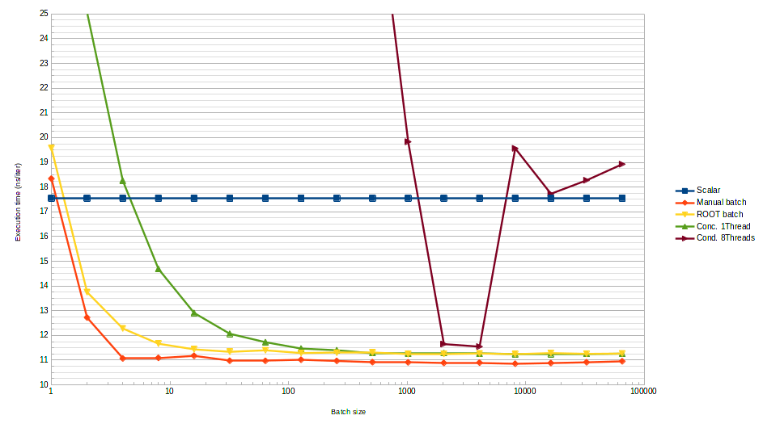

# Parallel histogramming with ROOT 7

- Interesting places in the ROOT source code:
    * `hist/hist/v7` contains the ROOT 7 histogramming library
    * `tutorials/v7` contains some usage examples:
        - `concurrentfill.cxx` is a multi-threaded fill example based on the
          RHistConcurrentFillManager histogram wrapper.
        - `perf.cxx` is a microbenchmark for histogram fill code, demonstrating
          the RHistBufferedFill mechanism.
        - `perfcomp.cxx` is a more elaborate version of that microbenchmark that
          demonstrates the effect of the choice of axis binning and does a
          performance comparison with ROOT 6 histograms.
        - Sadly, these examples are written in ROOT style and don't even have
          a `main()` function, must be tweaked before they are usable.

- Build with `g++ -O3 -march=native -std=c++17 -pthread -lCore -lHist foo.cxx`
    * Container setup: `docker run --rm -it -v `pwd`/hists-mt:/mnt root-6.18-dev`
    * Then call `export LD_LIBRARY_PATH=/usr/local/lib:$LD_LIBRARY_PATH`

- What ROOT 7 `hist` provides...
    * Mostly headers, a little bit of impl extracted in `src`, and some tests
      and benchmarks. Let's look at those headers...
    * `RAxis.hxx` represents histogram axes, that's where binning is managed.
    * `RHist.hxx` is the `RHist` histogram template, which is parametrized by
      dimensionality, "precision" (= bin data type), and whatever statistics you
      may want to collect during the histogramming process (e.g. number of data
      points, uncertainties...)
        - Most of the work is offloaded to `RHistImplBase`, which we'll hear
          about soon enough...
    * `RHistBinIter.hxx` is the machinery used to iterate over histogram bins.
    * `RHistBufferedFill.hxx` provides the eponymous wrapper around `RHist` that
      internally buffers `Fill()` calls in order to call `FillN()` in batches.
      That is more efficient due to indirections in `RHist`...
    * `RHistConcurrentFill.hxx` provides the `RHistConcurrentFillManager`
      wrapper. This class provides mutex-protexted `FillN()` interfaces, and
      can spawn `RHistConcurrentFiller`s which are mostly `RHistBufferedFill`
      variants that commit their output as `FillN` transactions into the
      `RHistConcurrentFillManager`.
    * `RHistData.hxx` contains some statistical data that `RHist`/`RHistImpl`
      can be configured to record. And some dirty metaprogramming black magic.
    * `RHistImpl.hxx` is where most `RHist` methods eventually get dispatched.
      This indirection can be used for various purposes, from type erasure for
      plotting to hiding the fact that histograms are templated by axis
      configuration, which is necessary for performance.
    * `RHistUtils.hxx` contains the "coordinate array" template, which is
      essentially an extension of `std::array` that tries to be more ergonomic.
    * `RHistView.hxx` contains, as the name suggests, a way to extract a view
      into a subset of some histogram's data.

- Remarks so far:
    * `RHist` hides bin data behind multiple layers of abstraction. Extracting
      the data to fill a ROOT 6 histogram will not be so easy.
    * To use `RHistConcurrentFiller` in Marlin, we'd need to somehow define a
      master copy of the histogram and have "child" processors fetch their own
      accessor from it. That's not a bad design, but it can take some time to
      work around.
    * Would be nice to start with a consolidated microbenchmark that merges all
      the existing ones into one.
    * To get this kind of histogram to work with atomics, I'll need some custom
      float type whose members compile down to relaxed atomic ops.

- There is a bug in `RHistBufferedFill::Flush()`. It doesn't reset the cursor,
  so calling it multiple times in a row will write the same data multiple times.
    * fCursor = 0 from `RHistBufferedFillBase::Fill()` should probably go here
    * `RHistConcurrentFiller::Flush()` seems equally vulnerable
    * To be reported to the ROOT team...

- Another bug: `RHistConcurrentFiller::GetHist()` and friends map to a
  nonexistent method of `RHistConcurrentFillManager`.

- The new `fillBench.cxx` is a superset of the `concurrentfill` and `perf`
  microbenchmarks provided by ROOT 7. It measures...
    * How advantageous batching `Fill()` calls with `FillN()` is, and what is
      the minimal granularity to achieve optimal performance.
        - Answer: Batched fills can be ~2x faster, optimal performance is
          already achieved with small batch sizes of 4 data points.
    * How ROOT 7's automatic `Fill()` batching mechanism compares to manual fill
      batching when all data has the same weight.
        - Answer: Asymptotically a bit slower (as it records weights), but very
          close. Need a bit more data points to amortize too, around 16.
    * What kind of slowdown one can expect from using concurrent histograms in
      sequential code. That's basically the overhead of an uncontended mutex,
      and gives a hint of the right buffer size for uncontended histograms.
        - Answer: Can be as fast as a non-concurrent histogram, but with much
          larger buffers. The optimum is reached with ~100 data points.
    * What kind of slowdown one can expect from using concurrent histograms
      under intense parallel pressure. That's an indicator of how far the buffer
      size may need to be increased when a histogram is contended.
        - Answer: As always, adding threads makes benchmarking more complex. In
          this particular case, this is due to CPU downclocking interacting with
          synchronization in complex ways. In any case, an optimum is reached
          around ~2048 data points on this 8-thread configuraiton.

- General plan for ROOT 7 -> ROOT 6 histogram conversion
    * Somehow, make sure that all RHistConcurrentFiller have flushed their
      buffers to the underlying RHist
        - Will require cooperation from the framework?
        - RHist, by itself, isn't aware of the existence of fillers, and
          therefore cannot ask them to flush.
        - An RHist wrapper could provide this functionality, at the cost of a
          complicated synchronization protocol.
        - It's probably better to make sure that Marlin processors flush their
          thread-local data... whenever they need to.
    * Setup a blank ROOT 6 histogram whose axis configuration matches that of
      the input RHist
        - If possible, otherwise raise either a compilation or runtime error
    * Transfer the statistical data from the ROOT 7 histogram to the ROOT 6 one
        - This implies a ROOT 7 histogram type containing all the data used by
          ROOT 6, including fTsumwx and friends.
        - Either that, or the data must be reconstructible from the contents of
          the histogram bins. E.g. fTsumwx2 can be reconstructed if each bins
          has recorded sumw2 information.
    * Hand over the ROOT 6 histogram to the user, cross fingers.